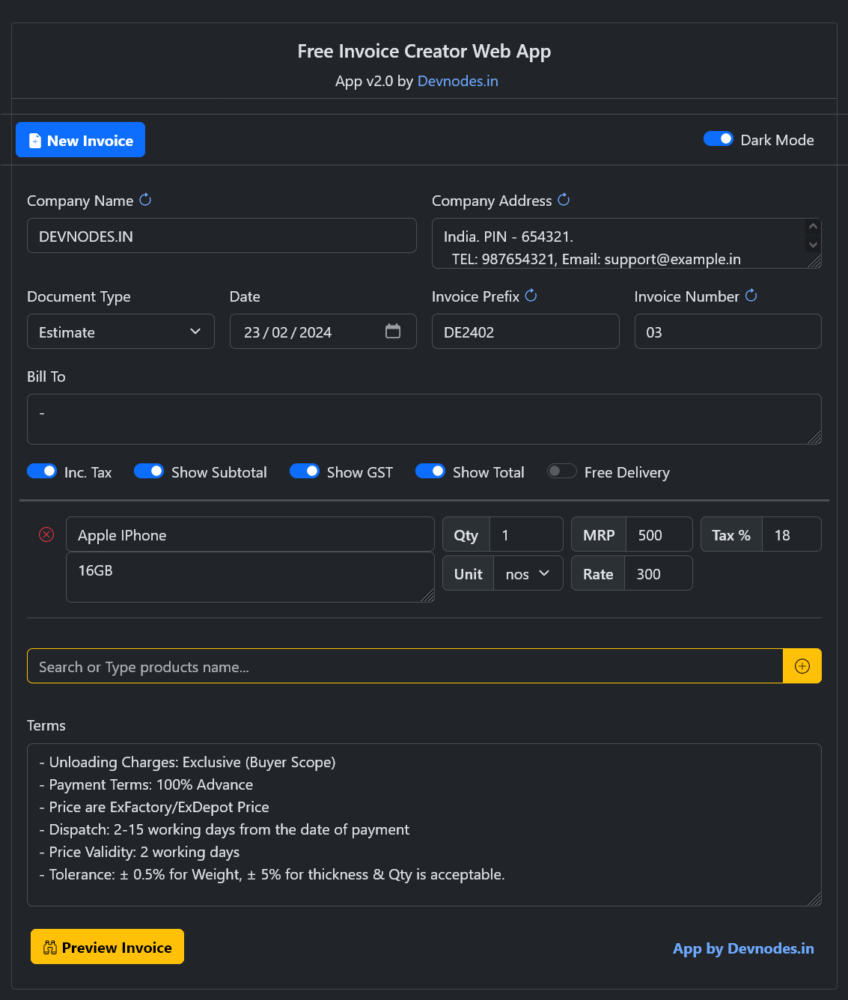

A fully web-based invoicing application is a web based application, (only uses html, css & js) that allows users to create, preview, and download invoice in PNG format. The application is created by [https://devnodes.in](https://devnodes.in)

The application is designed to be easy to use and can be accessed from any device with an internet connection.

Try Live App: [https://thalib.github.io/free-invoice-maker](https://thalib.github.io/free-invoice-maker)

Github repo: [https://github.com/thalib/free-invoice-maker](https://github.com/thalib/free-invoice-maker)

## Features

* Customizable settings, such as company details, invoice number, notes, company logo.
* Ability to download invoices in PNG format.
* Option to change in bill type to: BILL, INVOICE, ESTIMATE AND NONE.
* Privacy: Your data is not shared with anyone else, not even the app developer.
* Security: Your data is stored in a secure vault on your computer.
* Performance: The app does not have to make a request to a third-party server every time the data is needed, which can improve the speed of the app.

## Screenshot

### Settings

### Sample invoice

## Need Customization

If you are looking for customization of this app, contact our team [https://devnodes.in](https://devnodes.in)
